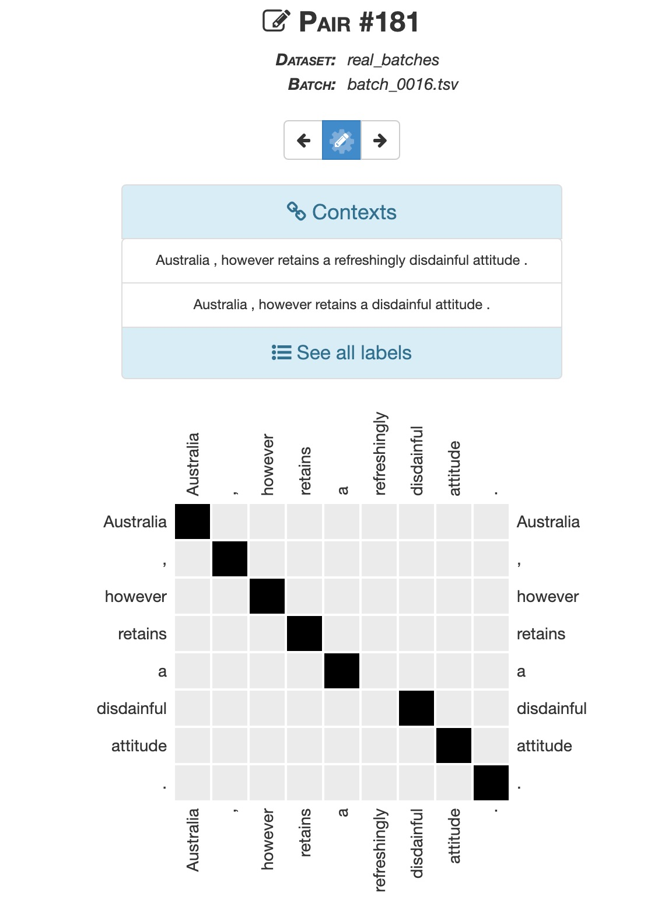
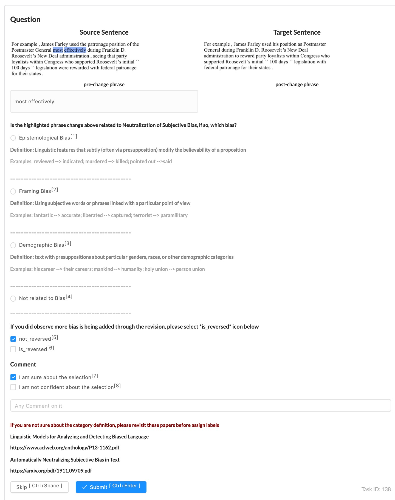

# Anntoation Interfaces
The annotation softwares, anntoation instructions, and introduction of tasks are in this folder.

## Word Alignment Annotation

### Introduction

   This task aims to align a pair of sentence on token-level, thus finding the non-identical modifications between a pair of sentences.

### Interface

More deatils on the setup of the tool and annotation guidlines can be found in the [file of guidelines](Annotation_guideline_examples.docx).

### Format
  
   Each line in the output files consists severl tab-separated columns.

   - sent1   &nbsp; &nbsp; &nbsp; &nbsp; (tokenized using NLTK)    
   - sent2   &nbsp; &nbsp; &nbsp; &nbsp; (tokenized using NLTK)    
   - alignments &nbsp; &nbsp;(word index pairs. i.e. <b>0:0 1:1 2:2 5:3</b> captures the matched word "I", "love", "it", and "." in sentence pair <b>I love it so much .</b> <>==> <b>I love it .</b>) 

## Bias Classification Annotation

### Introduction

This task aims to identify which type of subjective bias is carried and then further removed from a single word / multi-word phrase pair's edition.

### Interface

The annotation software is built on top of [label-studio](https://github.com/heartexlabs/label-studio). More deatils on the setup of the tool can be found in the [file of guidelines](Annotation_guideline_setup.docx).

